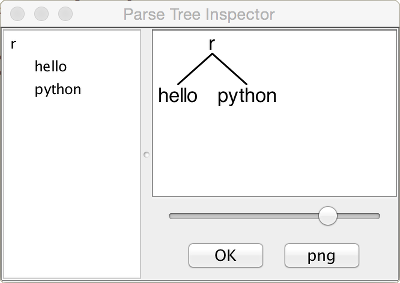

# Antlr4 Project:  
## Investigate parsing Python data structures using the Antlr v4 tool.

***

#### Antlr Documentation Page:
[https://theantlrguy.atlassian.net/wiki/display/ANTLR4/ANTLR+4+Documentation](https://theantlrguy.atlassian.net/wiki/display/ANTLR4/ANTLR+4+Documentation)  

### A First Example

- [__Source:__ [Getting Started with Antlr V4](https://theantlrguy.atlassian.net/wiki/display/ANTLR4/Getting+Started+with+ANTLR+v4)]  
- I.e., After you have setup and installed Antlr v4 on your platform.  
  
  
#### In a temporary directory, put the following grammar inside file `Hello.g4`:

```
// Define a grammar called Hello  
grammar Hello;  
r  : 'hello' ID ;         // match keyword hello followed by an identifier  
ID : [a-z]+ ;             // match lower-case identifiers  
WS : [ \t\r\n]+ -> skip ; // skip spaces, tabs, newlines  
```

#### Then run ANTLR the tool on it:
```
$ cd /tmp  
$ antlr4 Hello.g4  
$ javac Hello*.java  
```

#### Now test it:
```
$ grun Hello r -tree  
hello python
^D
(r hello python)
```

(That ^D means EOF on Unix; it's ^Z in Windows.) The -tree option prints the parse tree in LISP notation.  

#### It's nicer to look at parse trees visually.

```
$ grun Hello r -gui  
hello python  
^D  
```

That pops up a dialog box showing that _rule_ `r` matched _keyword_ `hello` followed by _identifier_ `python`.  



### A Second Example
#### Using the `Python.g4` grammar.

```
$ cd python
$ antlr4 Python.g4
$ javac Python*.java
```

#### Now test it:
```
$ grun Python python -tree  
{ "a": 1, "b": (2, 3), "c": [1, 2, "foo"], "d": "boggle"}
^D
(python (dict { (pair "a" : (value 1)) , (pair "b" : (value (tuple ( (value 2) , (value 3) )))) , (pair "c" : (value (list [ (value 1) , (value 2) , (value "foo") ]))) , (pair "d" : (value "boggle")) }))
```
